

<!-- Slide 1: Title -->
<!-- _class: title -->

ART INSTITUTE OF CHICAGO · SEPTEMBER 2026

<h1>An Afternoon With Art</h1>

A family, a birthday, and an unexpected afternoon at the Art Institute of Chicago

Dr. Chukwuma I. Onyeije, MD, FACOG · Chukwuma Theology

---

<!-- Slide 2: Before the Paintings -->
<!-- _class: split -->

  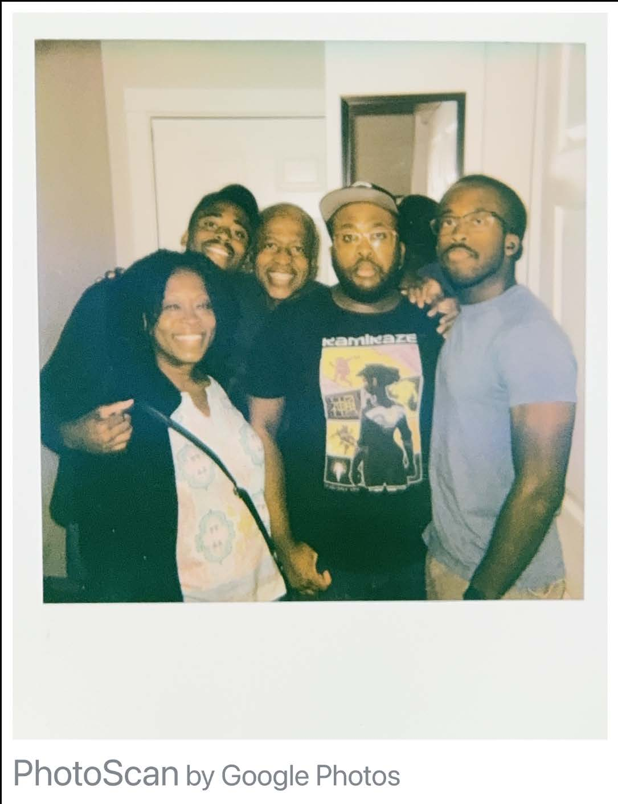
  
Chicago · September 2026

  
PROLOGUE

  <h2>Before the Paintings</h2>
  

  
<strong>The trip came first.</strong> We were in Chicago because my youngest son, Chidiebere, was turning twenty-four. Chi Chi and I had come with our three sons: <strong>Obi, Nnamdi, and Chidiebere</strong>.

  
It was a chilly, rainy day — the kind that made several hours inside the Art Institute feel like a particularly good idea.

  

    
"I did not go into the museum intending to write a book. I was a father spending a weekend with his family. That matters, because the family context changed what I saw — especially before Abraham and Isaac."

  

  
There is something increasingly precious about getting all of us into the same place. Five adults moving through Chicago together.

---

<!-- Slide 3: How I Want to Remember It -->

THE METHOD OF ENCOUNTER

<h2>How I Want to Remember It</h2>

Three distinct things were happening simultaneously with every canvas and sculpture:

  

    
Layer 01

    <h4>What the Museum Told Me</h4>
    
Names, dates, materials, artistic movements, and formal histories. I needed that information, but I did not want it to become the only voice.

  

  

    
Layer 02

    <h4>What I Actually Saw</h4>
    
Faces, surfaces, scale, color, awkward details, brushwork, and reflections — things that made me walk closer or step back before I knew why they mattered.

  

  

    
Layer 03

    <h4>What It Caused Me to Think About</h4>
    
Fatherhood. Faith. Medicine. Nigeria. Technology. Labor. Aging. Mortality. Sometimes nothing grand — only honest wonder, surprise, or confusion.

  

  
"I do not want every work neatly decoded. Sometimes the most accurate sentence is simply: <em>I am still not sure what I think about this.</em>"

---

<!-- Slide 4: 01 Abraham -->
<!-- _class: split -->

  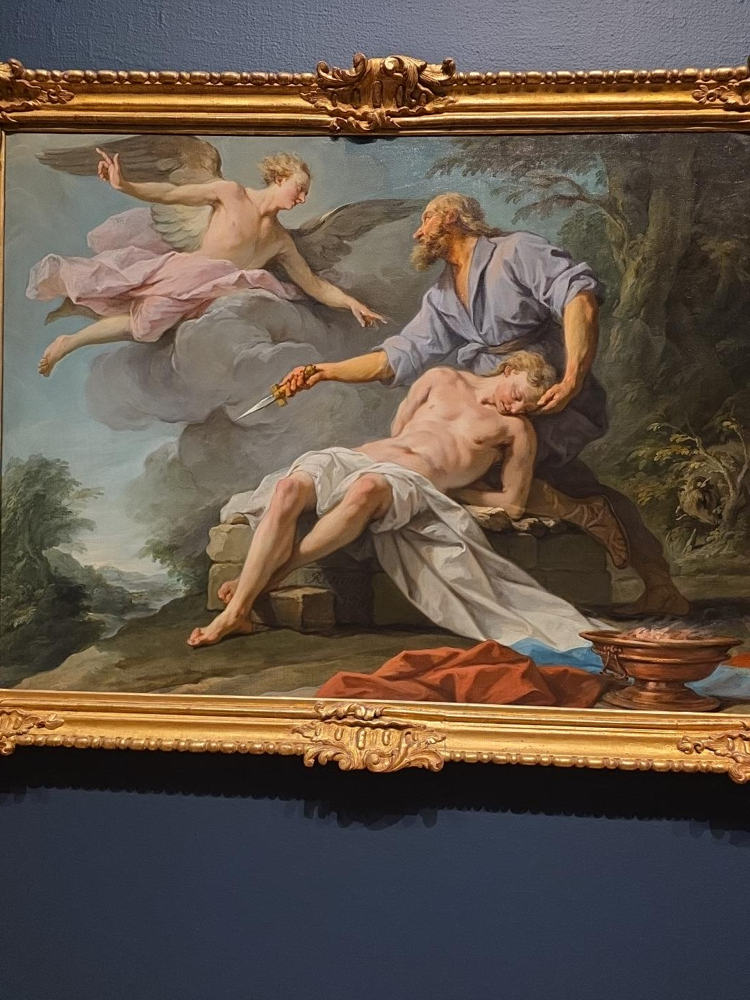
  
Jean II Restout · The Sacrifice of Abraham (1746)

  
ENCOUNTER 01 · SACRED ART & FATHERHOOD

  <h2>Abraham: The Hand That Held the Knife</h2>
  

  
  

    
A Father Before Moriah

    
It was the anguish in Abraham's face that stayed with me. Having read Genesis 22 for decades, standing with my three adult sons in the museum, I stopped seeing Abraham primarily as an ancient patriarch and saw him as a father.

  

  

    
The Two Hands

    
One hand holds the sacrificial knife high in mid-air. The other hand cradles Isaac's head tenderly upon the altar — shielding his boy even while the blade is poised.

  

  

    
"The painting made me remain in the moment Scripture moves through quickly: the son, the father, the knife, and the interruption. Art made the story human again."

  

---

<!-- Slide 5: 02 Seurat -->
<!-- _class: split -->

  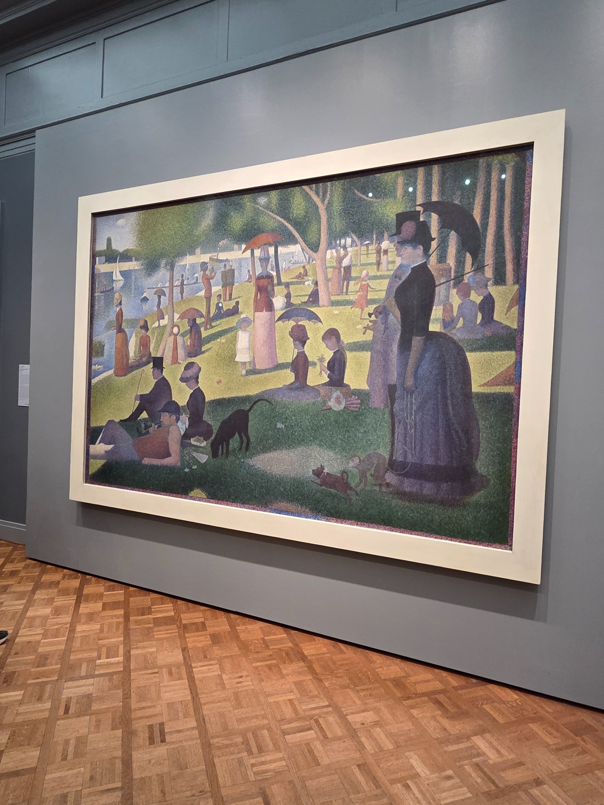
  
Georges Seurat · A Sunday on La Grande Jatte — 1884 (1884–86)

  
ENCOUNTER 02 · SCALE & CLINICAL GAZE

  <h2>From Across the Room</h2>
  

  

    
What I Saw

    
From a distance there was an entire cohesive world: people, water, umbrellas, sunlight. Up close, that coherent world dissolved into isolated dots of pure pigment.

  

  

    
What the Museum Told Me

    
Points of pure color designed to mix in the viewer's eye; Seurat seeking a modern, timeless Parisian harmony through rigorous pointillist technique.

  

  

    
The Lesson for Medicine

    
A measurement can be true. A lab value can be true. A diagnosis can be true. <strong>But so is the human being that appears only when you step back far enough.</strong>

  

---

<!-- Slide 6: 03 Van Gogh -->
<!-- _class: split -->

  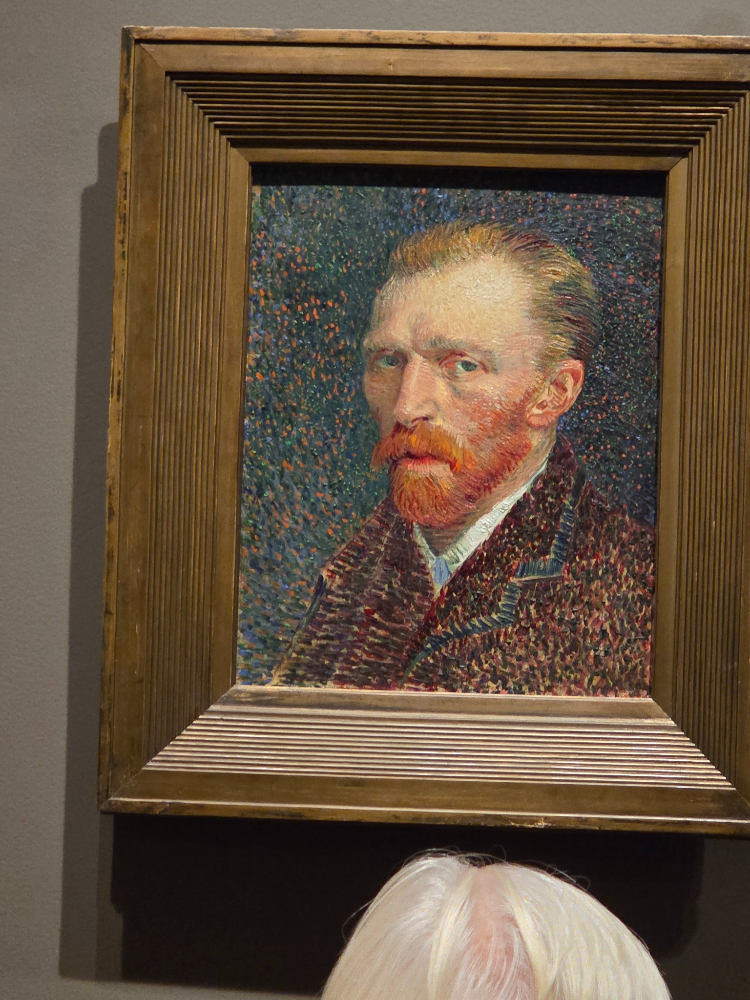
  
Vincent van Gogh · Self-Portrait (1887)

  
ENCOUNTER 03 · BIOGRAPHY & PRESENCE

  <h2>A Face I Thought I Knew</h2>
  

  

    
Meeting the Paint Before the Myth

    
Van Gogh is so familiar that it is easy to meet the tragic biography before meeting the paint. In person, what struck me was the surface: short, urgent dabs of pigment vibrating around the face and coat.

  

  

    
Responding to Paris

    
Seen just after Seurat, the connection was alive: Van Gogh adapting pointillist experiments to his own restless, searching rhythm.

  

  

    
"This was simply a man looking at himself — and, because he painted the encounter, allowing strangers more than a century later to look back."

  

---

<!-- Slide 7: 04 Marcus-Bello Bench -->
<!-- _class: split -->

  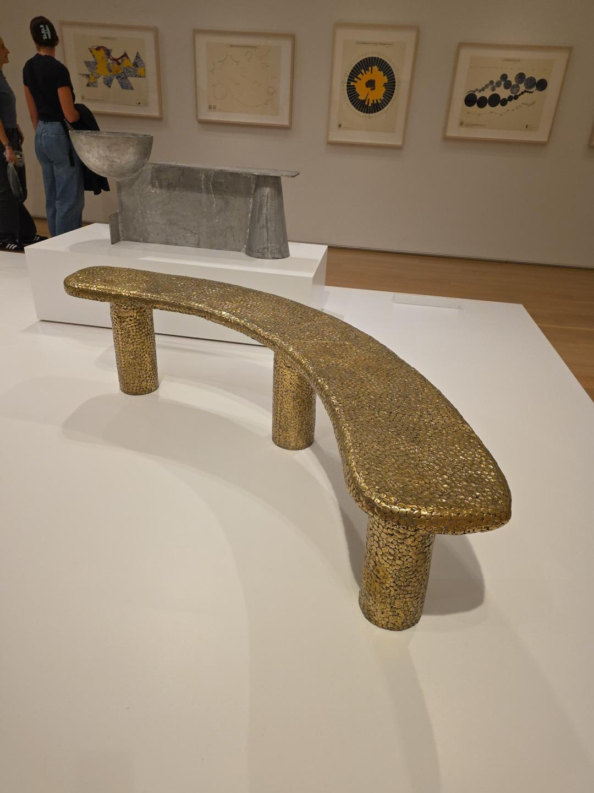
  
Nifemi Marcus-Bello · Friction Ridge Bench, Orikì (Act I)

  
ENCOUNTER 04 · CONTEMPORARY NIGERIAN DESIGN

  <h2>A Fingerprint Large Enough to Sit On</h2>
  

  

    
Monumental Human Trace

    
I first saw an unusual bench. Then I saw the fingerprint. Something normally confined to the tip of a finger had become monumental.

  

  

    
Contemporary Africa in the Museum

    
As a Nigerian, I appreciated encountering contemporary Nigerian design here — not Nigeria preserved safely in the archaeological past, but Nigeria actively shaping modern dialogues on identity, materials, and making.

  

  

    
Labor Made Visible

    
A polished object can make labor disappear. The enlarged fingerprint did the opposite: <strong>it made the human trace enormous.</strong>

  

---

<!-- Slide 8: 05 Marcus-Bello Headrest -->
<!-- _class: split -->

  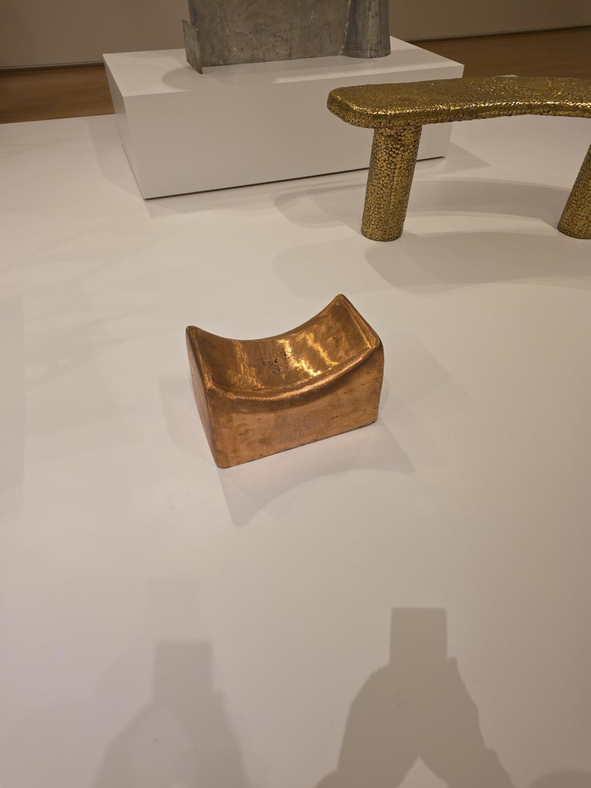
  
Nifemi Marcus-Bello · Headrest, Orikì (Act III)

  
ENCOUNTER 05 · MATERIALITY & SUPPLY CHAINS

  <h2>Objects Have Histories</h2>
  

  

    
Intimacy and Provenance

    
A headrest is intimate: a human body rests against it. But the material came from somewhere, passed through other hands, and carries a history that finished objects conceal.

  

  

    
The Weight of Technology

    
A phone, a computer, and even the "cloud" feel weightless when we use them. But they depend on minerals, factories, electricity, labor, transport, and physical infrastructure.

  

  

    
"Nothing arrives from nowhere. The question I carried away was simple: <em>What had to happen in the world for this object to arrive in front of me?</em>"

  

---

<!-- Slide 9: Interlude -->
<!-- _class: split -->

  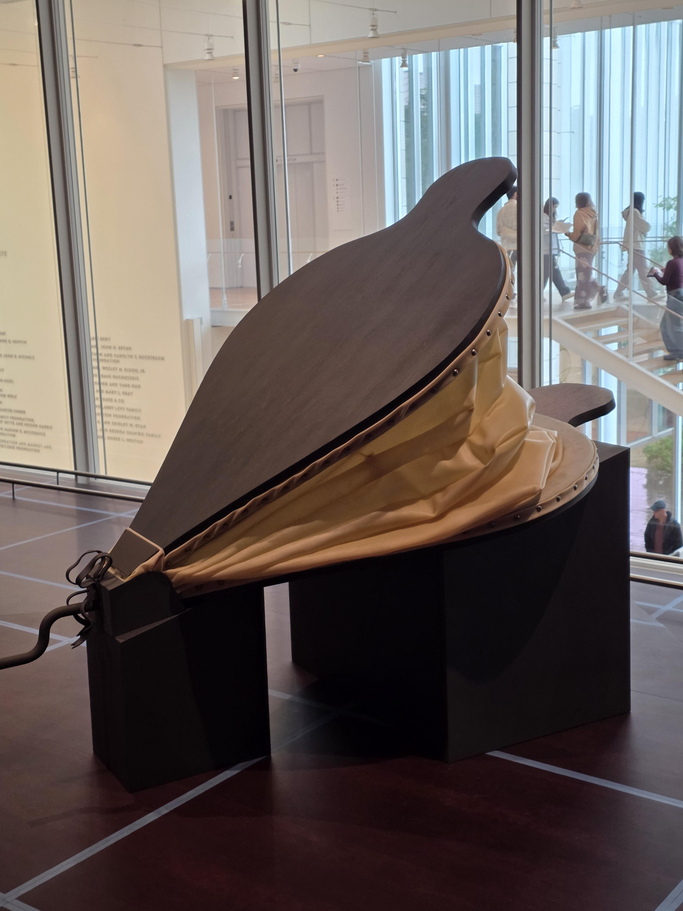
  
Unidentified gallery object · Photographed before cataloging

  
INTERLUDE · WONDER IN THE AGE OF AI

  <h2>Curiosity Preserved</h2>
  

  

    
Photographing Before Naming

    
I photographed this before I knew what to call it. A museum visit does not have to be a sequence of successful, instantaneous classifications.

  

  

    
The Trap of Pocket AI

    
With artificial intelligence in our pockets, every encounter threatens to become a routine workflow: <em>photograph, identify, explain, move on</em>.

  

  

    
"Identification is not the same thing as understanding. Sometimes curiosity should be allowed to remain curiosity for a while."

  

---

<!-- Slide 10: 06 Hopper Nighthawks -->
<!-- _class: split -->

  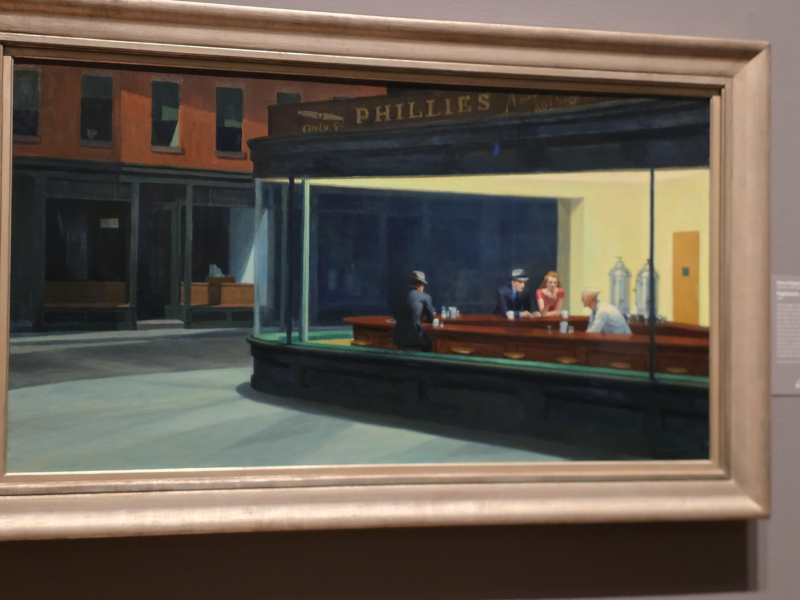
  
Edward Hopper · Nighthawks (1942)

  
ENCOUNTER 06 · PROXIMITY & ISOLATION

  <h2>Nighthawks: Light Without Warmth</h2>
  

  

    
What the Museum Told Me

    
Hopper's diner is imagined rather than a literal portrait; the label highlights the isolation of the figures and the total absence of any visible entrance.

  

  

    
What I Saw

    
Bright fluorescent light without warmth. People physically close, yet profoundly separated. As a viewer, I could see inside the glass but could not enter.

  

  

    
The Contrast of Family

    
I was in Chicago with my family. The contrast mattered: <strong>Four people together in a painting were not necessarily less lonely than one person alone.</strong>

  

---

<!-- Slide 11: 07 Peter Blume The Rock -->
<!-- _class: split -->

  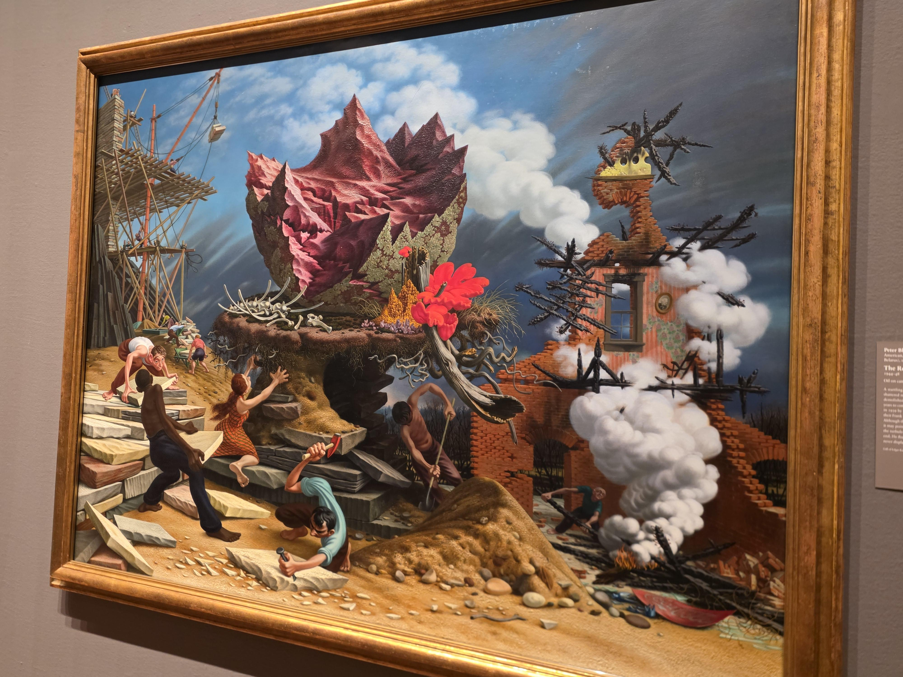
  
Peter Blume · The Rock (1944–48)

  
ENCOUNTER 07 · RECONSTRUCTION & MEDICINE

  <h2>The Rock: What Deserves to Be Rebuilt?</h2>
  

  

    
Devastation and Renewal

    
Blume connects crowded, difficult imagery to World War II devastation and reconstruction, while resisting neat, easy resolution.

  

  

    
Wreckage vs. Hope

    
I was not sure whether I found it hopeful. People were rebuilding, but the wreckage had not disappeared.

  

  

    
The Medical Parallel

    
Technology promises to rebuild healthcare. Yet we often digitize an old, broken workflow and call it modernization. <strong>The question is not how quickly we rebuild, but what deserves to be rebuilt.</strong>

  

---

<!-- Slide 12: 08 Grant Wood American Gothic -->
<!-- _class: split -->

  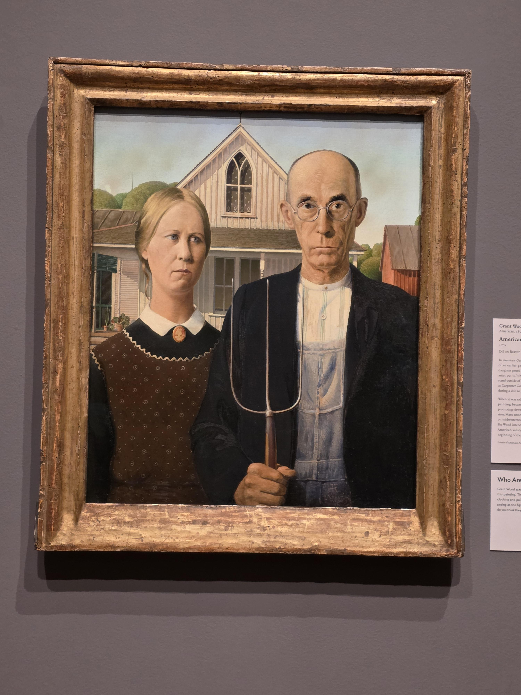
  
Grant Wood · American Gothic (1930)

  
ENCOUNTER 08 · DUTY & GENERATIONS

  <h2>American Gothic: The Dignity & Cost of Duty</h2>
  

  

    
Restraint and Discipline

    
The pitchfork, austere clothing, guarded expressions, and gothic window all reflect intense discipline and self-restraint.

  

  

    
Affection Expressed as Work

    
Generations in which affection was expressed less by words than by work — providing, remaining, repairing, rising at dawn to do the necessary thing again.

  

  

    
"There is dignity in that. There can also be a cost when duty becomes so visible that tenderness disappears."

  

---

<!-- Slide 13: 09 Rockwell The Dugout -->
<!-- _class: split -->

  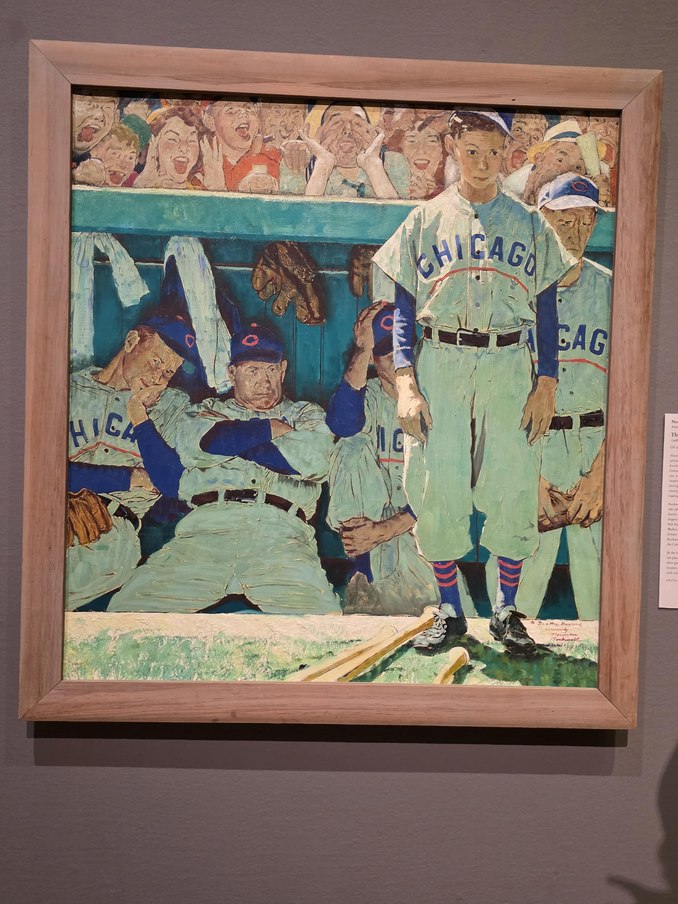
  
Norman Rockwell · The Dugout (1948)

  
ENCOUNTER 09 · RESILIENCE & ADVERSITY

  <h2>The Dugout: Painting the Slump</h2>
  

  

    
The Non-Triumphant Moment

    
Rockwell did not paint the heroic home run; he painted dejected Chicago Cubs players sitting in the dugout beneath jeering Boston fans.

  

  

    
Medicine, Leadership, Fatherhood

    
All reward competence. But some days do not go well — sometimes through mistakes, sometimes despite flawless preparation, sometimes because life goes somewhere unexpected.

  

  

    
"The crowd remembers the score. The person in the dugout has to decide whether to come back tomorrow."

  

---

<!-- Slide 14: 10 Wasson Twenty Mule Team -->
<!-- _class: split -->

  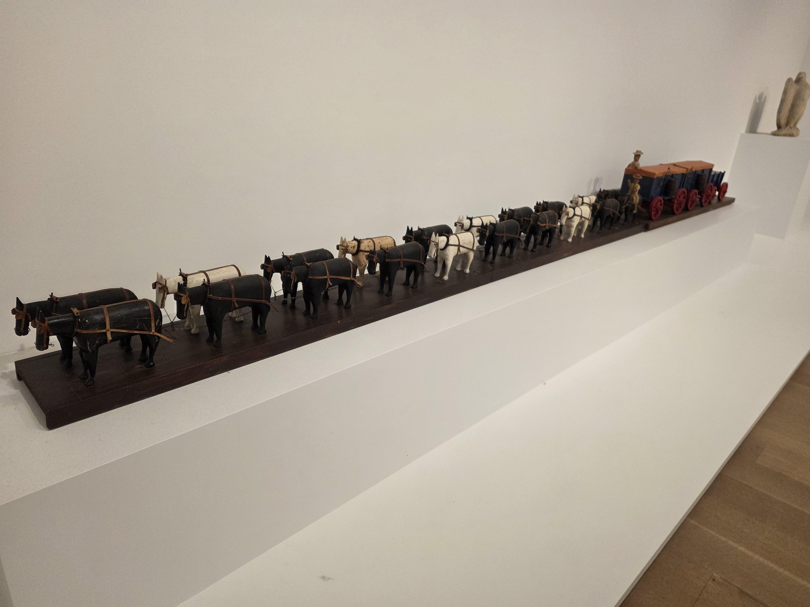
  
Arthur "Slim" Wasson · Twenty Mule Team

  
ENCOUNTER 10 · MINIATURES & MEMORY

  <h2>A Small World Carrying a Large History</h2>
  

  

    
Condensing Vast Systems

    
Miniatures make large systems manageable. Industry becomes a wagon. Crushing labor becomes a carved figure. A vast landscape occupies a few feet.

  

  

    
How Families Build Memory

    
Families do something similar. Decades of living become stories: <em>Remember when...</em> Told often enough, a story becomes part of what a family believes itself to be.

  

  

    
"This book is doing the same thing: I am taking one rainy afternoon in Chicago and constructing a memory of it."

  

---

<!-- Slide 15: 11 Juan Gris Picasso -->
<!-- _class: split -->

  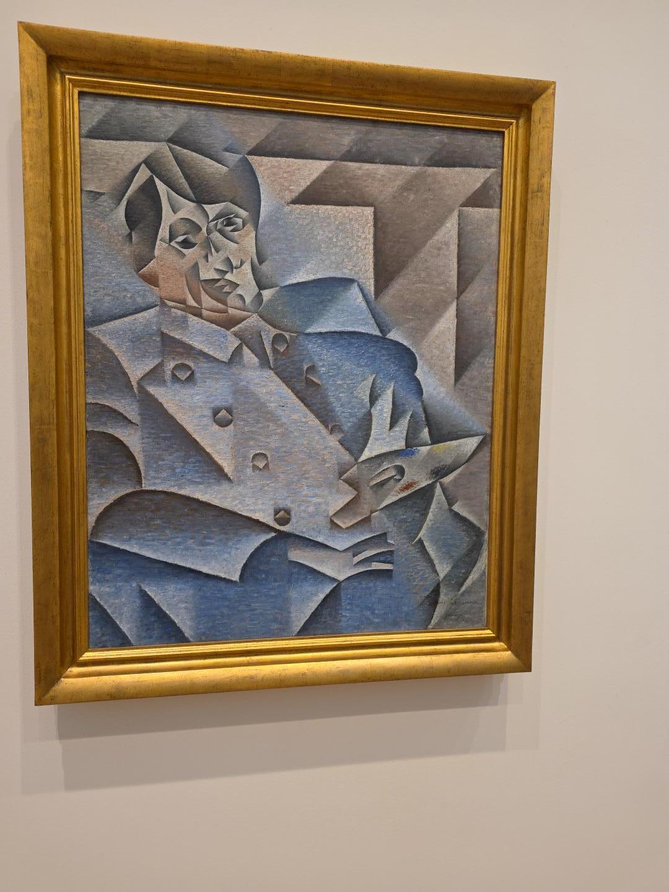
  
Juan Gris · Portrait of Pablo Picasso (1912)

  
ENCOUNTER 11 · PERCEPTION & IDENTITY

  <h2>Picasso, Seen by Someone Else</h2>
  

  

    
Surrendering the Photograph

    
I knew I was looking at a man, but the man had been disassembled. I could recognize a portrait only after surrendering the expectation that it behave like a photograph.

  

  

    
The Versions of Ourselves

    
We create curated versions of ourselves — CVs, websites, social feeds. But my wife sees a version colleagues do not. My sons see another. Patients see another.

  

  

    
"What does another person see in me that I cannot see from inside myself?"

  

---

<!-- Slide 16: 12 Ludwig Meidner -->
<!-- _class: split -->

  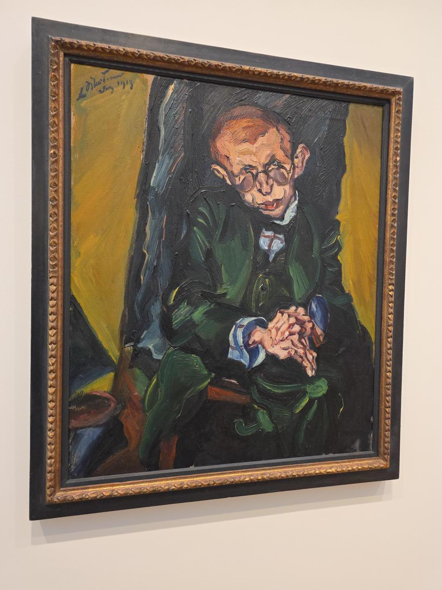
  
Ludwig Meidner · Max Herrmann-Neisse

  
ENCOUNTER 12 · CLINICAL GAZE & HUMANITY

  <h2>A Face Before a Biography</h2>
  

  

    
Medicine Teaches You to Look

    
Pain has a face. Anxiety has a face. Fatigue has a face. Grief has a face. Long before you consult the charts, you look at the patient's eyes.

  

  

    
The Limits of the Chart

    
An electronic medical record can contain extraordinary amounts of factual truth about a patient while completely failing to contain the human person.

  

  

    
"I am glad I saw this face before I learned the biography. History came later. Humanity came first."

  

---

<!-- Slide 17: 13 Fernand Leger -->
<!-- _class: split -->

  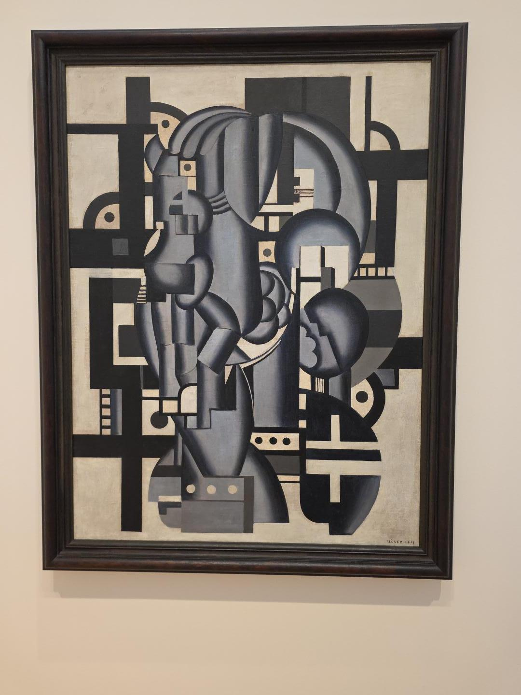
  
Fernand Léger · Composition in Blue

  
ENCOUNTER 13 · ANTHROPOLOGY & AUTOMATION

  <h2>Body, Machine, or Both?</h2>
  

  

    
Renegotiating the Boundary

    
Body? Machine? Architecture? We are living through a moment when the line between human and machine is being radically renegotiated.

  

  

    
AI in the Everyday

    
I speak and software transcribes. Algorithms summarize. AI generates language. I find this exciting — but we must notice what it does to our self-understanding.

  

  

    
"Where does the machine end, and where do I begin?"

  

---

<!-- Slide 18: 14 Francis Picabia -->
<!-- _class: split -->

  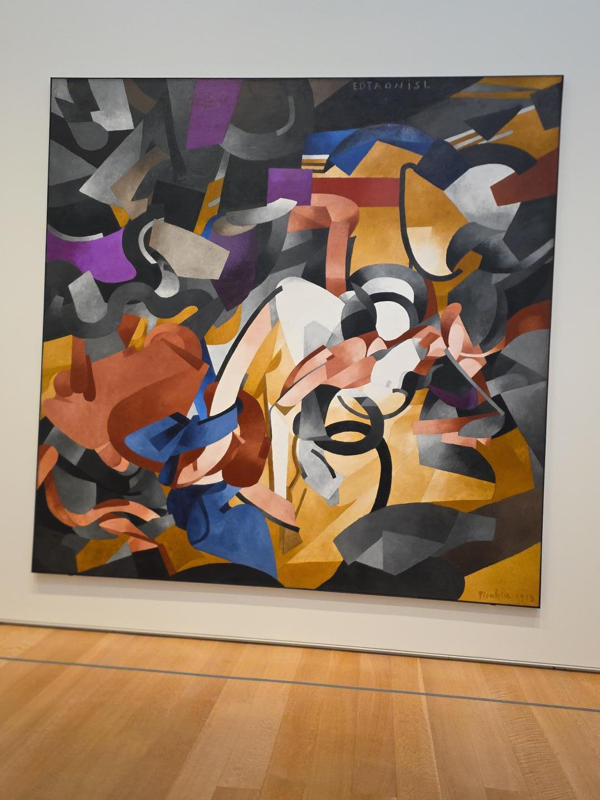
  
Francis Picabia · Edtaonisl (Ecclesiastic)

  
ENCOUNTER 14 · INTELLECTUAL HUMILITY

  <h2>Not Everything Needs to Be Solved</h2>
  

  

    
The Painting That Refused to Behave

    
Even the title seemed determined not to help me. Information did not make the painting obvious — and I liked that.

  

  

    
Information vs. Understanding

    
Walking through a museum in 2026 with AI in our pockets allows instant identification. But identification can masquerade as understanding.

  

  

    
"I am still not sure what I think about this painting. I want that sentence to remain in the book."

  

---

<!-- Slide 19: Epilogue 1 -->
<!-- _class: split -->

  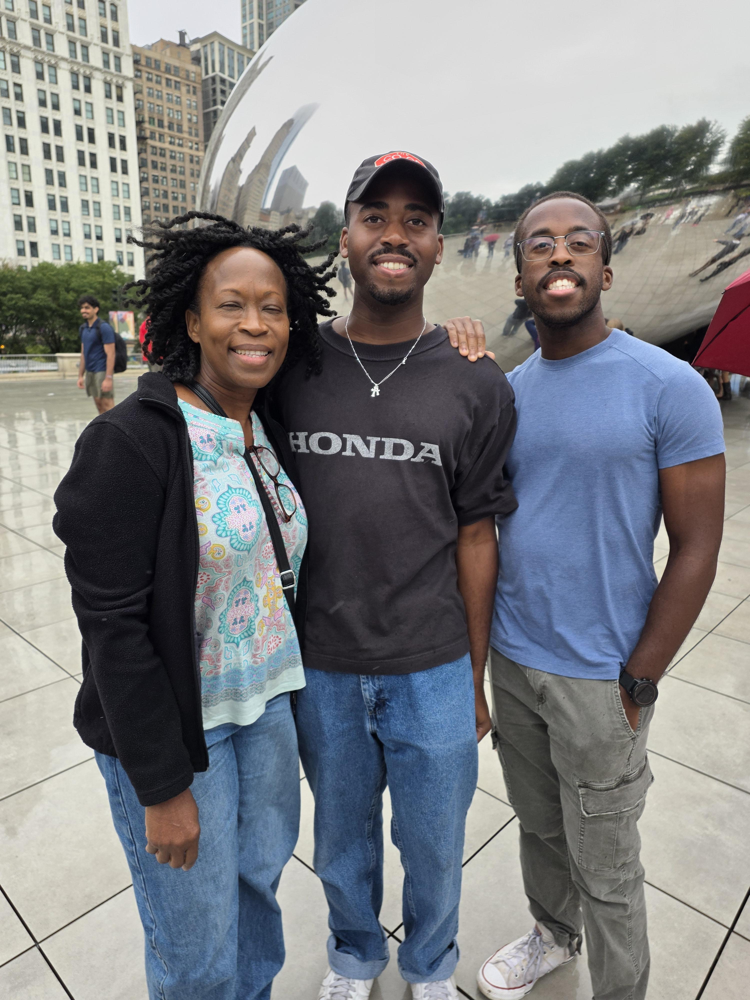
  
Chicago streets · September 2026

  
EPILOGUE · FROM ART TO LIFE

  <h2>Out into the Rain</h2>
  

  
  
"For several hours I had been looking at other people's attempts to preserve human experience.

  
  
Then I walked outside and began taking photographs of the people whose lives actually belong to mine."

  
Returning to the city with Chi Chi, Obi, Nnamdi, and Chidiebere — the living encounter that grounded everything.

---

<!-- Slide 20: Closing Benediction -->
<!-- _class: split -->

  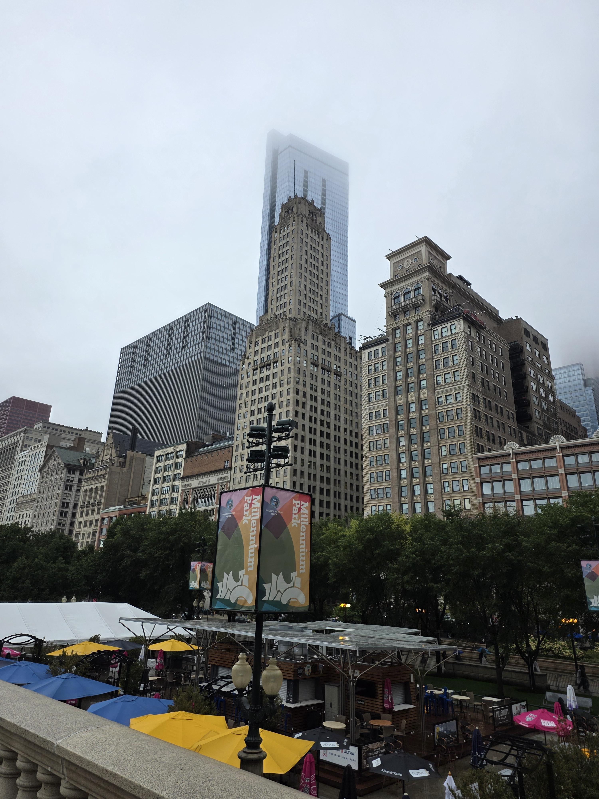
  
Chi Chi, Obi, Nnamdi, Chidiebere & Chukwuma · Chicago 2026

  
CHICAGO · SEPTEMBER 2026

  <h2>The Unrepeatable Afternoon</h2>
  

  

    

      "The museum happened inside a birthday weekend. Chidiebere was twenty-four. Chi Chi, Obi, Nnamdi, Chidiebere, and I were together in Chicago.  
      <strong>I can return to a painting. I cannot return to exactly this afternoon.</strong>  
      That does not make the afternoon sad. It makes it valuable."
    

  

  

    <strong>Chukwuma Theology</strong> · Reflections on Art, Faith, and Life 
    Dr. Chukwuma I. Onyeije, MD, FACOG
  

